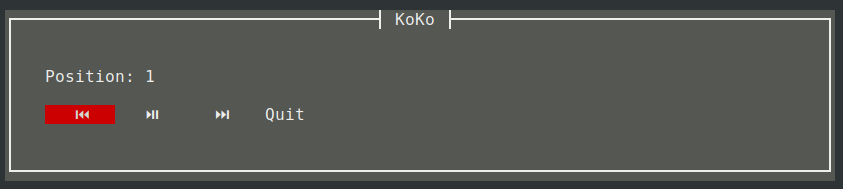

# KodiKontroller for Kodi

Copyright Erkki Seppälä <erkki.seppala@vincit.fi> 2021

Licensed under the [MIT license](LICENSE.MIT).

KodiKontrol is a program for streaming local files to
[Kodi](https://kodi.tv/).

It works by starting a web server on a dynamically allocated port and
hosting the files listed from the command line on that server; then it
instructs the Kodi instance to pick those files as its playlist and
then provides a simple terminal interface for controlling the
playback.

A simple IP-based access control is implemented, so only the Kodi
instance provided is able to access the files.

## Installation

1) Install the Rust compiler with Cargo e.g. with https://rustup.rs/

2) TODO `sudo apt-get install probably some stuff`

3) `git clone --recursive https://github.com/eras/KodiKontrol`

This step is required due to [Cargo not supporting relative submodule
paths](https://github.com/rust-lang/cargo/issues/7992), and I would
prefer to use them in this case.

4) `cargo install --path KodiKontrol`

5) `$HOME/.cargo/bin/koko` has now been installed

## Usage

To run (or maybe test) with a local instance, just run

`% koko *.mp4`

To define another address, use

`% koko -k mykodi foo.mp4`

IP addresses are also permitted. User/pass parameters aren't actually functional yet..

`--help` works.

### Shortcuts

| Key        | Function                                                    |
|------------|-------------------------------------------------------------|
| [/PageUp   | Previous entry in playlist or the beginning of current one. |
| ]/PageDown | Next entry in playlist                                      |
| ,          | Short seek backwards                                        |
| .          | Short seek forwards                                         |
| <          | Long seek backwards                                         |
| >          | Long seek forwards                                          |
| space      | Play/pause                                                  |
| q          | Quit                                                        |
